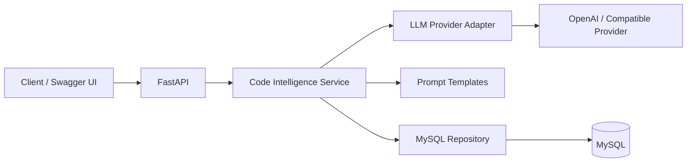
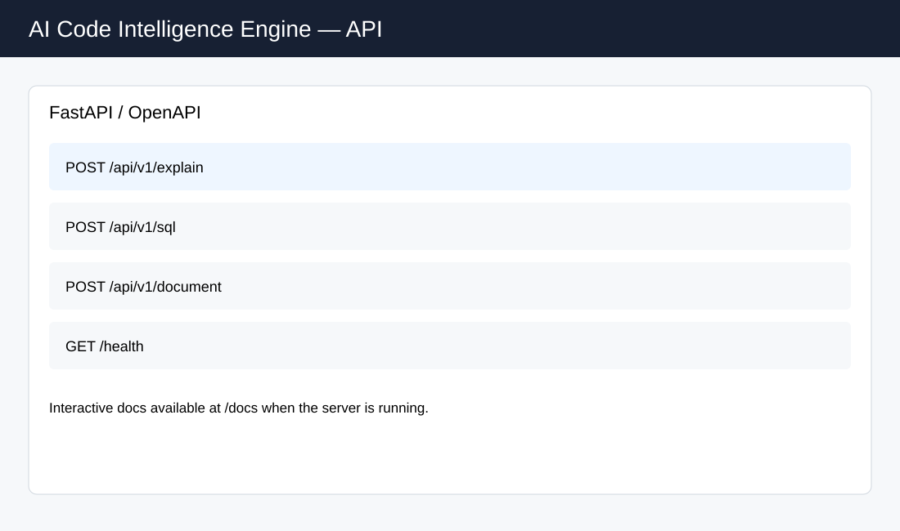
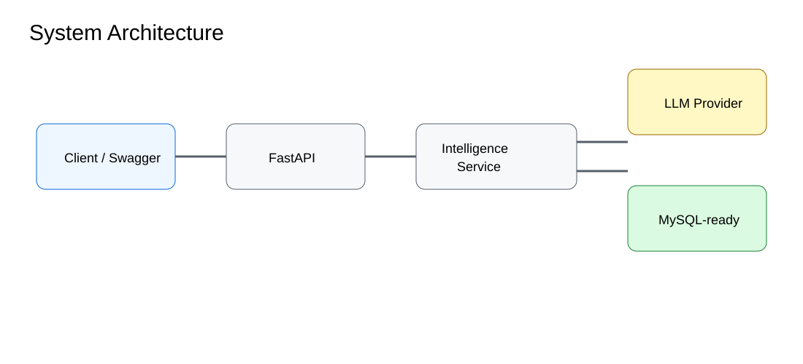

# AI Code Intelligence Engine

An AI-assisted developer productivity backend built with **FastAPI**, **LangChain-compatible LLM abstraction**, and **MySQL-ready persistence**.

## Features
- Explain Python, JavaScript, Java, SQL and other source code snippets.
- Generate SQL from natural-language requests.
- Generate technical documentation from code.
- Multi-language code analysis through a single API.
- MySQL-ready execution history storage.
- Deterministic demo mode for local development without an API key.
- Interactive FastAPI/OpenAPI documentation.

## Architecture



## API
- `POST /api/v1/explain`
- `POST /api/v1/sql`
- `POST /api/v1/document`
- `GET /health`

## Quick start

```bash
python -m venv .venv
# Windows
.venv\Scripts\activate
# macOS/Linux
source .venv/bin/activate

pip install -r requirements.txt
copy .env.example .env
uvicorn app.main:app --reload
```

Open http://127.0.0.1:8000/docs

Set `LLM_MODE=demo` for a zero-key local demo. For a real provider, configure `LLM_MODE=api` and the provider variables in `.env`.

## Example

```json
POST /api/v1/explain
{
  "language": "python",
  "code": "def add(a, b): return a + b"
}
```

## Screenshots

### API documentation


### System architecture


## Project structure

```text
app/
  api/routes.py
  core/config.py
  schemas/models.py
  services/intelligence.py
  repositories/history.py
  main.py
tests/
docs/screenshots/
.env.example
requirements.txt
```

## Notes
This repository is a portfolio implementation of the project scope described in the portfolio/resume. Provider credentials and production infrastructure are intentionally externalized through environment variables.

## Production-style support files
- `Dockerfile` and `docker-compose.yml` for containerized local development.
- `Makefile` for common commands.
- `.github/workflows/ci.yml` for automated tests.
- `docs/API.md` and `examples/` for API usage.
- `docs/screenshots/product-overview.svg` for the polished product preview.

The visual assets are repository documentation mockups, not claims of a deployed production UI.
